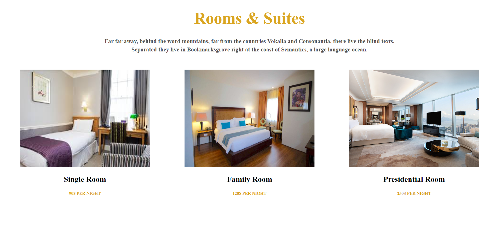

<h2>I used HTML, CSS for this page.</h2>
<b>Style Properties:</b>
<ul>
    <li>center tag</li>
    <li>margin</li>
    <li>line-height</li>
    <li>display: flex</li>
    <li>justify-content: space-around </li>
    <li>font-size</li>
</ul>
<h4>I used image height: 300px and width: 300px</h4>
